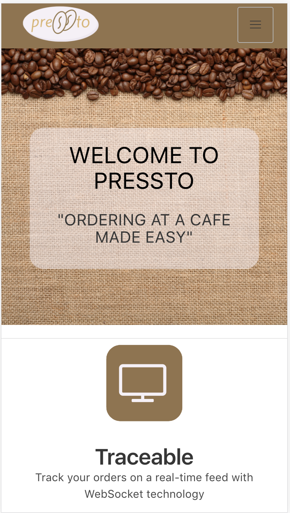
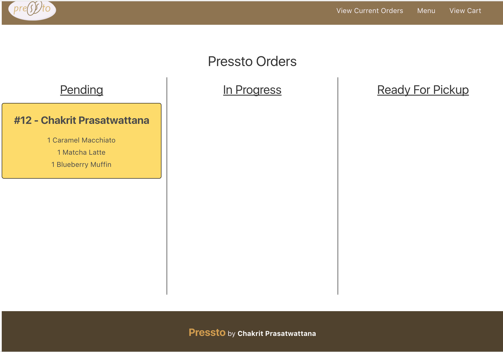
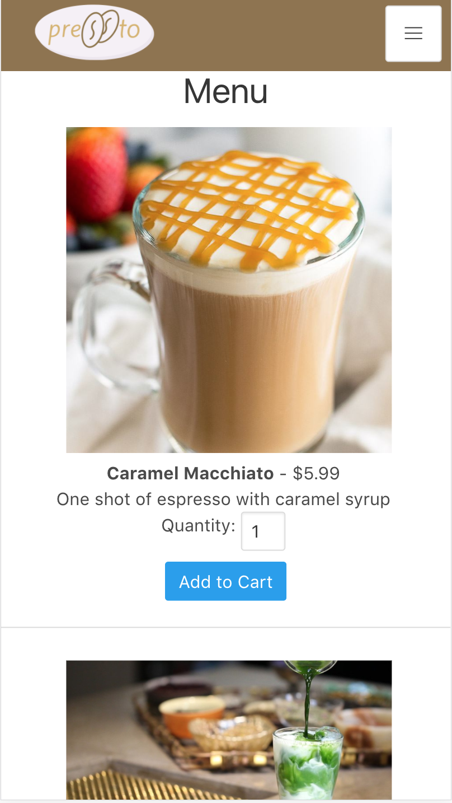
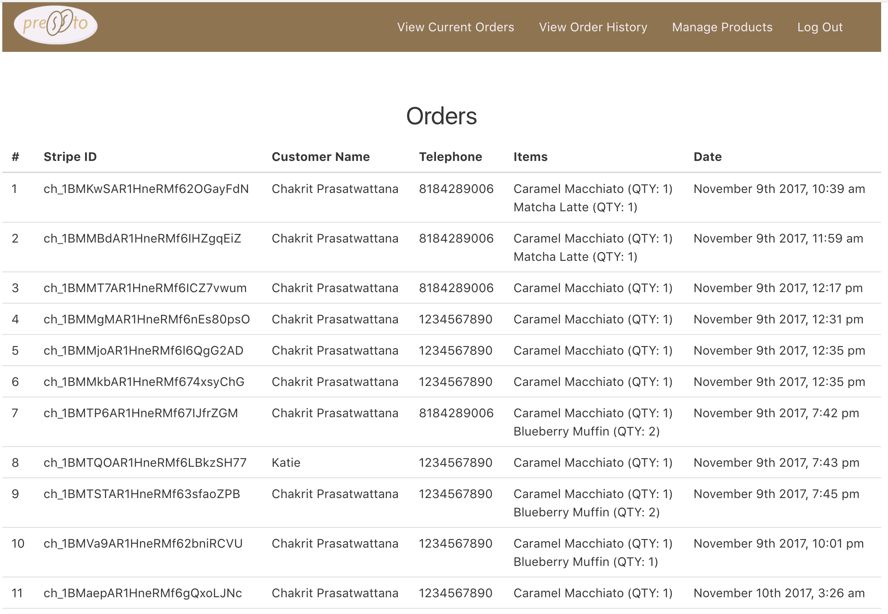

# Pressto

Pressto allows you to order drinks and food all from the convienience of your phone or tablet. Pressto takes credit and debit card payments through the Stripe API, a secure payment gateway. As an administrator, you are able to keep track of orders and update the status of orders, allowing customers to see the status of the orders realtime with Socket.io

View the app [here](https://ga-pressto.herokuapp.com/)

## Screenshots

## Technologies
The general technologies for this project include:

- HTML
- CSS/SASS
- React.js
- Node.js
- Express
- Mongo
- Git/Github
- Heroku

The technologies and libraries used on the **server** side include:

- Express
- Mongoose
- Mongoose-Sequence
- Dotenv
- JWT (JSON Web Tokens)
- Morgan
- Socket.io
- Stripe API

The technologies and libraries used on the **client** side include:

- axios
- bulma
- jwt-decode
- moment
- react
- react-alert
- react-confirm-alert
- react-dom
- react-router-dom
- react-scripts
- react-stripe-checkout
- socket.io-client

## Workflow
The process started out with wireframing and wanting to implement a project with a real time update feature using web sockets. After the rough wireframing process, ERD diagrams were created which led to scaffolding the models in a Node/Express App. The next step consisted of finishing a full RESTful API using Node/Express and the other technologies mentioned above.

After the API was created, the React client app was created and utilizing web sockets (socket-io) and the Stripe Checkout API

The final step was to include any styles using CSS and some npm packages for alerts (e.g. react-alert).

Wireframes, user stories and tasks can be found on the [Trello Board](https://trello.com/b/6DH1DXDf/project-4-pressto)

## User Stories
The main user stories for the MVP are as follows:

- As a user, I want to be able to order coffee or food from a menu on my phone
- As a user, I want to be able to view my place in line on a screen so I know how long I will have to wait
- As a staff member, I want to be able to modify the status of orders in real time
- As a user, I want to able to add multiple menu items to my shopping cart
- As a signed in admin, I want to be able to view a list of my past orders

# Biggest Challenges
- Stripe API
- Socket IO

# Known Bugs
- Deleting a product will remove the product from all previous orders in the order history
- Minimal error handling and flash messages on the admin panel when incorrect information or data types are inputted

# Features To Add In The Future
- Notifying users on their device (through text or on the app) when their order is ready
- Image upload capability from admin panel when creating or editing products
- Sign in feature for users so they don't have to put in their name and telephone number all the time
- Signed in users could save favorite orders
- More error handling and pop ups for incorrect data input

# Installation Instructions
- Fork the repo and run `npm install` to install the dependencies for the server
- Run `cd client` and run `npm install` to install the dependencies for the client app
- Run `nodemon` on the root folder to start the server on `http://localhost:3001`
- Inside the `/client` folder, run npm start and view the client on `http://localhost:3000`

